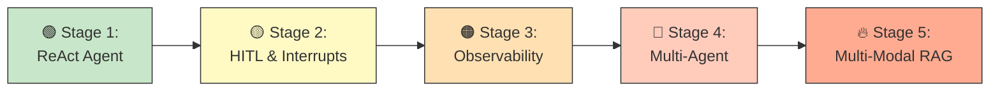
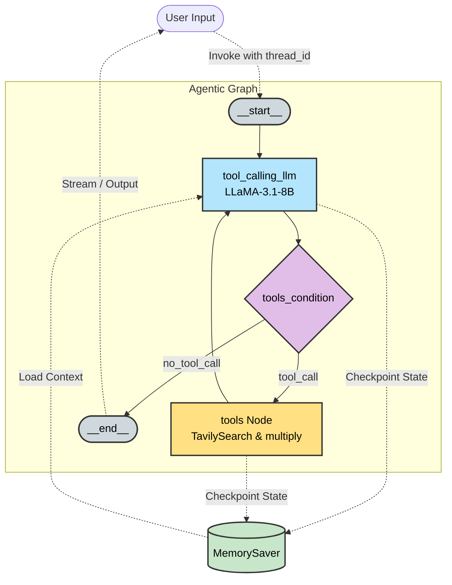
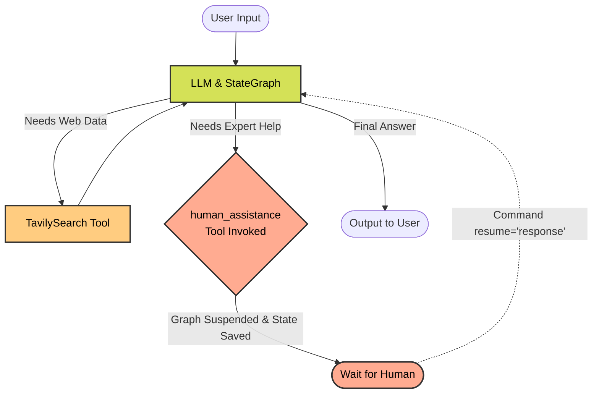
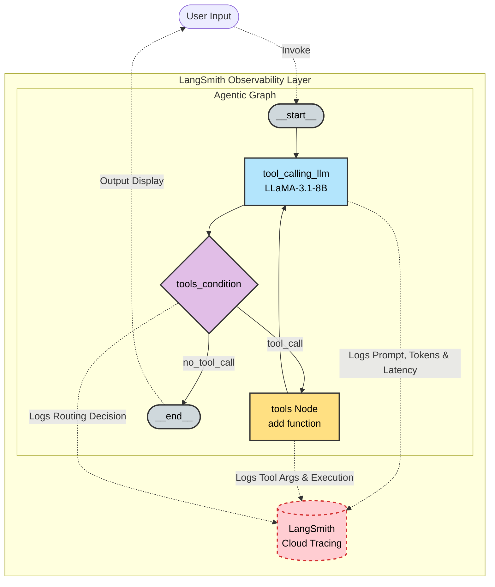
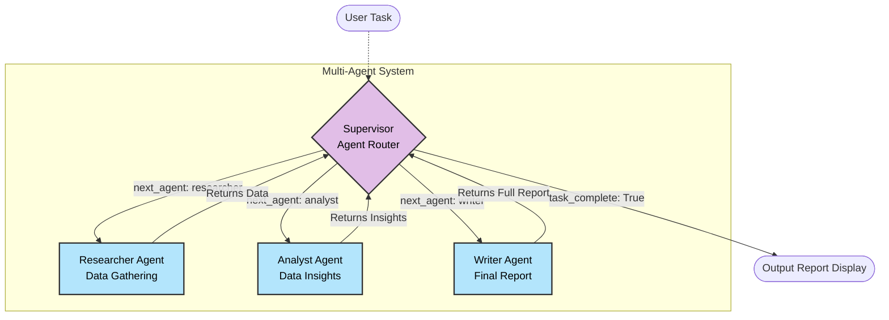
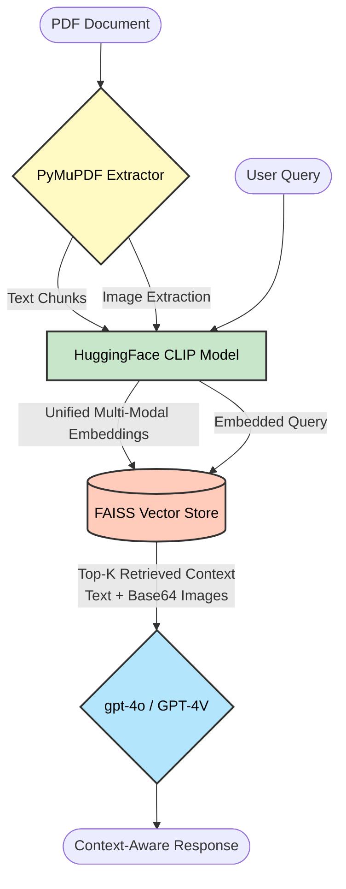

# AgenticAI Systems

Welcome to **AgenticAI Systems**! This repository was created by me to document the progressive development of AI-powered chatbots and agentic workflows using **LangChain** and **LangGraph**. The intention behind this project is to showcase the ability to build LLM-based agents and chatbots from their *very basic foundations* all the way up to advanced and complex agentic systems. 
### 🌟 Core Capabilities
- 🤖 **Autonomous Agents**: Custom ReAct architectures with dynamic tool-calling.
- 🤝 **Human-in-the-Loop**: Seamless workflow interruption and stateful resumes.
- 📈 **Industrial Monitoring**: Full LangSmith integration for tracing and latency breakdown.
- 👥 **Multi-Agent Orchestration**: Hierarchical systems with specialized worker personas.
- 🖼️ **Multi-Modal RAG**: Advanced vision-augmented retrieval using CLIP & FAISS.

## 🚀 Features & Progression

This repository contains a series of targeted Jupyter Notebooks and Python scripts, structured progressively to demonstrate advancing stages of agentic complexity.

### 🛤️ Progression Roadmap

| Stage | Core Focus | Key Concepts & Technologies |
| :--- | :--- | :--- |
| **Stage 1**<br>[`chatbotstage1.ipynb`](./chatbotstage1.ipynb) | **ReAct Agent Foundation** | `StateGraph`, Tool-Calling (`TavilySearch`), Conversational Memory (`MemorySaver`) |
| **Stage 2**<br>[`chatbotstage2.ipynb`](./chatbotstage2.ipynb) | **Human-in-the-Loop (HITL)** | Pausing execution via `interrupt()`, Stateful Resumes via `Command` |
| **Stage 3**<br>[`chatbotstage3.1.py`](./chatbotstage3.1.py) \| [`debugandmon.ipynb`](./chatbotstage3_debugandmon.ipynb) | **Deep Observability** | **LangSmith** Tracing, Token Logging, Execution Latency Metrics |
| **Stage 4**<br>[`chatbotstage4_multipleagents.ipynb`](./chatbotstage4_multipleagents.ipynb) | **Multi-Agent Architecture** | Centralized Router, Persona-Based Workers (Researcher, Analyst, Writer) |
| **Stage 5**<br>[`chatbotstage5_multimodel_rag_langchain.ipynb`](./chatbotstage5_multimodel_rag_langchain.ipynb) | **Advanced Multi-Modal RAG** | `PyMuPDF` (Text & Base64 Images), `HuggingFace CLIP`, `FAISS`, Vision LLMs |
*\*The progression is designed such that each stage builds directly on those preceding it.*

## Deep Dive: Stage 1 Chatbot (`chatbotstage1.ipynb`)



The first stage of the AgenticAI progression serves as a comprehensive introduction to building conversational agents and agentic architectures using the **LangGraph** framework. It illustrates the transition from a simple LLM wrapper to a fully-fledged ReAct agent with memory and tool-calling capabilities.

### 1. Basic Setup & LLM Integration
We start by defining a `StateGraph` and a `TypedDict` state object with a `messages` key. The agent is powered by **Groq's LLaMA 3.1 8B**, initializing the graph to accept user input and return a direct LLM response.

### 2. Tool Integration
The notebook explores giving the LLM the ability to interact with external functions:
- **Search Tool**: Integration with `TavilySearch` to fetch real-time information from the web.
- **Custom Functions**: A user-defined `multiply` function to perform mathematical calculations.

### 3. ReAct Agent Architecture
Moving beyond linear responses, the graph is upgraded to a **ReAct (Reasoning + Acting)** architecture using `tools_condition`. The agent can intelligently decide whether to respond directly or route the execution to a `ToolNode` to gather more context before formulating the final answer.

### 4. Memory & Checkpointing
To support multi-turn conversations, the graph incorporates LangGraph's `MemorySaver`. This checkpointer saves the state of the graph per `thread_id`, allowing the agent to remember context such as the user's name across different conversational turns.

### 5. Streaming Responses
Finally, the notebook demonstrates advanced conversational flows by utilizing both synchronous (`.stream()`) and asynchronous (`.astream_events()`) streaming methods. This enables streaming intermediate steps, tool calls, and token-by-token outputs in real-time.

## Deep Dive: Stage 2 Chatbot (`chatbotstage2.ipynb`)



Building upon the robust foundation of Stage 1, this notebook introduces the crucial concept of **Human-in-the-Loop (HITL)** interactions, which is essential for safely pausing and resuming agentic workflows.

### 1. The `human_assistance` Tool
A custom tool is defined using LangGraph's `interrupt()` function. When the LLM decides it needs external guidance (for example, expert help in building an AI agent), it invokes this tool, which safely suspends the graph's execution and waits for human input.

### 2. Checkpointing for Interrupts
Just like multi-turn conversations, HITL workflows require state persistence. The notebook utilizes `MemorySaver` to checkpoint the exact state of the graph prior to the interruption, ensuring that no context or prior tool calls are lost while waiting for the user.

### 3. Resuming Execution with `Command`
Once the human provides the requested input or guidance, the graph execution is resumed using LangGraph's `Command(resume=...)` object. The human's response is injected directly back into the state, allowing the LLM to process the feedback, continue its reasoning, and ultimately resolve the user's initial query.

## Deep Dive: Stage 3 Chatbot (`chatbotstage3.1.py`, `chatbotstage3_debugandmon.ipynb`)



As architectures grow more complex with multiple tools and routing paths, robust observability becomes paramount. Stage 3 introduces integration with **LangSmith** to provide seamless tracing, debugging, and monitoring for agentic workflows.

### 1. Enabling LangSmith Tracing
By setting environment variables (`LANGCHAIN_TRACING_V2`, `LANGCHAIN_PROJECT`, etc.), LangGraph automatically traces the exact execution path of the `StateGraph`. This logs every node transition, LLM call, and tool execution without modifying the core agent logic.

### 2. Inspecting Tool Calls & Latency
The LangSmith dashboard allows developers to natively inspect deeply nested tool calls (e.g., passing arguments to the `multiply` or `add` function), monitor token usage for prompt/completion, and track the exact latency of each specific node execution in real-time.

### 3. Production Readiness
<b>This stage emphasizes the transition from local prototyping to production-ready monitoring.</b> The `chatbotstage3.1.py` script specifically demonstrates how to deploy this traced agent as a standalone Python execution outside of Jupyter.

## Deep Dive: Stage 4 Chatbot (`chatbotstage4_multipleagents.ipynb`)

Moving beyond a single LLM processing multiple tools, Stage 4 implements a **Supervised Multi-Agent Architecture**. This involves distinct, specialized AI personas collaborating under a central orchestrator.



### 1. Supervisor State & Central Routing
The `SupervisorState` tracks precisely what data has been collected so far (research data, analysis, final report). The `supervisor_agent` uses an LLM decision chain to determine whether the task needs researching, analyzing, writing, or if it is completely finished. It then triggers the router to update the `next_agent`.

### 2. Specialized Worker Agents
Instead of one general prompt resolving everything, the execution is split among:
- **Researcher Agent**: Exclusively gathers raw data and facts requested.
- **Analyst Agent**: Examines the researcher's output to extract strategic implications and insights.
- **Writer Agent**: Formats the compiled research and analysis into a professional, concise executive report.

### 3. Iterative Collaboration
Each worker agent explicitly tackles its micro-task and passes the incrementally updated global state back to the `supervisor`, which then automatically triggers the next phase. This segregation of duties significantly reduces hallucinations and drastically improves the system's ability to handle highly complex, multi-step generation pipelines.

## Deep Dive: Stage 5 Chatbot (`chatbotlevel5_multimodel_rag_langchain.ipynb`)

The pinnacle of this repository’s progression is **Stage 5**, which implements an **Advanced Multi-Modal Retrieval-Augmented Generation (RAG)** pipeline. Moving beyond simple text constraints, this agent can natively \"read\" and understand both textual data and visual data (images/charts) simultaneously.



### 1. Document Parsing & Image Extraction
Using `PyMuPDF` (`fitz`), the pipeline meticulously rips through documents (e.g., `stats_qa.pdf`), extracting dense text while explicitly isolating embedded images, charts, and graphs. Text is heuristically split using LangChain's `RecursiveCharacterTextSplitter`.

### 2. Unified Multi-Modal Embeddings (CLIP)
To bridge the semantic gap between text and pixels, the architecture utilizes OpenAI's `clip-vit-base-patch32` via HuggingFace `transformers`. This uniquely embeds both the text chunks and the extracted images into the exact same high-dimensional semantic vector space. 

### 3. Advanced Retrieval (FAISS) & Vision Generation
All encoded multimodal features are saved into a high-performance **FAISS** vector database. When a user asks a question (like "What does the GDP chart show?"), the question itself is converted using CLIP. FAISS rapidly searches physical similarity to find the most relevant text chunks and images, which are finally fed as contextual base64 objects into a Vision-language model to formulate a precise answer.

## 🛠️ Technology Stack

- **Frameworks**: [LangChain](https://www.langchain.com/), [LangGraph](https://langchain-ai.github.io/langgraph/)
- **Monitoring & Tracing**: [LangSmith](https://smith.langchain.com/)
- **Models/Providers**: [Groq](https://groq.com/) (e.g., Llama-3), OpenAI, and capabilities for handling multiple models.
- **Vector Store**: FAISS
- **Online Search Capabilities**: Tavily Search

## 📦 Installation & Setup

1. **Clone the repository:**
   ```bash
   git clone <repo-url>
   cd AgenticAIv2
   ```

2. **Create a virtual environment (optional but recommended):**
   ```bash
   python -m venv venv
   source venv/bin/activate 
   ```

3. **Install dependencies:**
   ```bash
   pip install -r requirements.txt
   ```

4. **Set up Environment Variables:**
   Create a `.env` file in the root directory and add your API keys. Refer to the existing `.env` structure. Example:
   ```ini
   GROQ_API_KEY=your_groq_api_key
   LANGCHAIN_API_KEY=your_langsmith_api_key
   OPENAI_API_KEY=your_openai_api_key
   TAVILY_API_KEY=your_tavily_api_key
   ```

